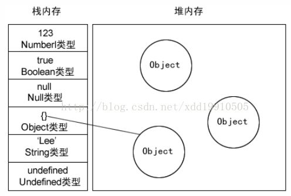

https://www.jianshu.com/p/8d4fa84c8b14  
今天他们遇到的 数组的深拷贝和浅拷贝 的答案
---------------------
https://blog.csdn.net/nate__river/article/details/79177292
对象的深拷贝和浅拷贝的答案

---------------------
https://www.zhihu.com/question/23031215 
深拷贝和浅拷贝的理解

### javasript 中的深拷贝和浅拷贝？  

对于这个问题，可以考虑从深拷贝和浅拷贝的使用或者起源说起，  
也就是为什么会出现这个问题？  

### 首先了解一些 javascript 的基本知识  

1. javascript变量包含两种不同的数据类型的值：基本数据类型和引用数据类型。  
基本数据类型指的是简单的数据段，包括es6里面新增的一共有6种，具体如下： 
number、string、boolean、null、undefined、symbol  

引用类型指那些可能由多个值构成的对象，只有一种如下：  
object  

在将一个值赋给变量时，解析器必须确定这个值是基本类型还是引用类型值。  
基本数据类型是按值访问的，因为可以操作保存在变量中的实际的值。  

引用类型的值是保存在内存中的对象。与其他语言不同，javascript 不允许直接访问内存中的位置，也就是说不能直接操作对象的内存空间。  
在操作对象时，实际上是在操作对象的引用而不是实际对象。  


2. javascript 的变量的存储方式 -- 栈（stack)和堆（heep)
栈：自动分配内存空间，系统自动释放，里面存放的是基本类型的值和引用类型的地址  
堆：动态分配的内存，大小不定，也不会自动释放。里面存放引用类型的值。
  

3. javascript 值传递与地址传递
基本类型与引用类型最大的区别实际上就是与传址的区别
值传递：基本类型采用的是值传递。
#### 值传递  
```html
<body>
    <script>
        var a = 100; // 定义一个变量a并赋值为100 
        var b = a;   // 将 a 的值100赋值给b（a,b都是基本类型：值传递）
        b++; // b自加
        console.log(a); // 100
        console.log(b); // 101
    </script>
</body>
```
#### 址传递  
```html
<body>
    <script>
        var a = [1, 2, 3]; // 数组是引用类型
        var b = a; // 地址传递：将 a 的地址赋值给 b，a，b指向同一块地址
        b.push(4); // 给 b 数组末尾追加一个 4 
        console.log(b); // [1, 2, 3, 4]
        console.log(a); // [1, 3, 3, 4]
    </script>
</body>
```
分析：由于 a 和 b 都是引用类型，采用的是址传递，即 a 将地址传递给 b ，那么 a 和 b 必然指向同一个地址（引用类型的地址存放在栈内存中），而这个地址都指向了堆内存中引用类型的值。当 b 改变了这个值的同时，因为 a 的地址也指了这个值，故 a 的值也跟着变化。

就好比是 a 租了一间房，将房间的地址给了 b， b通过这个地址找到了房间，那么 b 对房间做的任何改变（添加一些绿色植物）对 a 来说 肯定是可见的。

那么如何解决上面出现的问题，就是使用浅拷贝或者深拷贝了。
#### 浅拷贝
浅拷贝解决就是先设置一个新的对象 obj2 ，通过遍历的方式将 obj2 对象的值--赋值给obj2对象。

代码如下：
```html
<body>
    <script>
        // // 数组的浅拷贝
        // var a = [1, 2, 3];
        // var b = [];
        // for (var i in a) {
        //     b[i] = a[i];
        // }
        // b.push(4);
        // console.log(a); // [1, 2, 3]
        // console.log(b); // [1, 2, 3, 4]
        // 对象的浅拷贝
        var obj1 = {
            'a': 1,
            'b': 2,
            'c': 3
        };
        var obj2 = {};
        for (var i in obj1){
            obj2[i] = obj1[i]
        }
        obj2['d'] = 4;
        console.log(obj1); // {a: 1, b: 2, c: 3}
        console.log(obj2); // {a: 1, b: 2, c: 3, d: 4}
    </script>
</body>
```
上面的代码只能实现一层的拷贝，无法进行深层次的拷贝，封装函数再次通过对象数组嵌套测试如下：
#### 浅拷贝函数封装
```html
<body>
    <script>
        function shallowCopy(obj1, obj2) {
            for (var key in obj1) {
                if(obj1.hasOwnProperty(key)) {
                    obj2[key] = obj1[key]
                }
            }
        }
        var obj1 = {
            fruits:['app', 'banner'],
            num: 100
        }
        var obj2 = {}

        shallowCopy(obj1, obj2) 
        obj2.fruits[0] = 'orange';
        console.log(obj1.fruits[0]); // orange
        console.log(obj2.fruits[0]); // orange

        
    </script>
</body>
```
结果证明，无法进行深层次的拷贝，这个时候我们可以使用深拷贝来完成，所谓深拷贝，就是能够实现真正意义上的数组和对象的拷贝，我们通过递归调用的方式实现。

#### 深拷贝
```html
<body>
    <script>
        function deepCopy(obj) {
            // 定义一个对象，用来确定当前的参数是数组还是对象
            // 此方法 检查 是否是数组
            // console.log(Object.prototype.toString.call(arr) === '[object Array]'); // true
            // var objArray = Array.isArray(obj) ? [] : {};
            function isArrayFn(val) {
                if( typeof Array.isArray === 'function') {
                    return Array.isArray(val);
                }else{
                    return Object.prototype.toString.call(val) === '[object Array]'
                }
            }
            var objArray = isArrayFn(obj) ? [] : {};
            if(obj && typeof obj === 'object') {
                for (key in obj) {
                    if(obj.hasOwnProperty(key)) {
                        // 如果 obj 的子元素是对象， 递归操作
                        if(obj[key] && typeof obj[key] === 'object'){
                            objArray[key] = deepCopy(obj[key]);
                        }else{
                            // 如果不是，直接赋值
                            objArray[key] = obj[key];
                        }
                    }
                }
            }
            return objArray; // 返回新的对象
        }
        var obj1 = {
            fruits: ['apple', 'banner'],
            num: 100 
        }
        var obj2 = deepCopy(obj1);
        obj2.fruits[0] = 'orange';
        console.log(obj1.fruits[0]); // orange
        console.log(obj2.fruits[0]);
    </script>
</body>
```

结果证明上面的代码可以实现深层次的克隆。
同时也可以用 jquery 下面的 extend 工具方法实现：
jQuery.extend([deep], target, object,object1,[objectN]);
第一个参数设置为 true ，则 jQuery 返回一个深层次的副本，递归地复制找到的任何对象。

#### 6-jquery的extend工具方法实现深拷贝
```html
<body>
    <script src="https://cdn.bootcss.com/jquery/3.3.1/jquery.min.js"></script>
    <script>
        var obj1 = {
            fruits: ['apple', 'banner'],
            num: 100
        }
        var obj2 = $.extend(true, {}, obj1);
        obj2.fruits[0] = 'orange';
        console.log(obj1.fruits[0]); // apple
        console.log(obj2.fruits[0]); // orange
    </script>
</body>
```
#### 7-利用 JSON 深拷贝
<body>
    <script>
        var test = {a:'a', b: {q:[1, 2, 3],b:'b'}} 
        var result = JSON.parse(JSON.stringify(test))
        console.log(test);
        console.log(result)
        console.log('------------------')
        console.log(result.b.q[1] = 3)
        console.log(test.b.q[1])
        
    </script>
</body>

